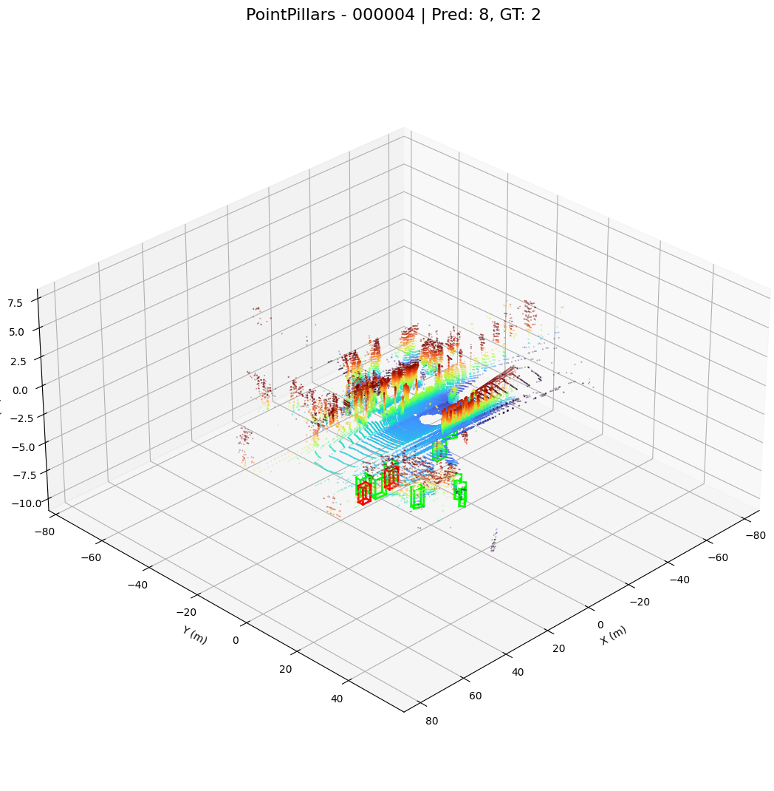

# Homework 2: 3D Object Detection

Chen Kai Zhang

## Note

Due to time and resource constraints, not all results are present in this repo. There was an accident when sorting the data causing the loss of the Waymo benchmark results. I had save the metrics beforehand, but unfortunately I was unable to recover the predicton visualization files.

## Overview

The goal of this project is to test the performance capabilities of different models on different datasets. For this project, we have chosen to compare the performance of **PointPillar** and **PV RCNN** on the **KITTI** and **Waymo KITTI** datasets. We will be using pretrained weight from MMDetection3D due to the limited time and resources.

## Project Setup

### Datasets

We will need the [KITTI](https://www.cvlibs.net/datasets/kitti/) and [Waymo Perception](https://waymo.com/open/). 


### Starting Environment

The entire project is containerized so we can start up the environment by running:

```
docker compose up -d
```

Although the Dockerfile should set up the majority of the environment, there are 2 more things required before we can start running experiments.

#### 1. Setting Up MMDetection3D

Access the container via:

```
docker exec -it mmdet3d-inference bash
```

Once in the shell, follow [Get Started](mmdet3d-inference) from the official MMDetection3D documentation to ensure proper tool installation.

#### 2. Loading Requirements

The Dockerfile only install the essential libraries, but additional ones are required. Install all necessary libraries by running:

```
pip install -r requirements.txt
```

#### 3. Preparing Waymo Dataset

KITTI is pretty straight forward. Download the required files to our local machine.

We need the Waymo dataset follow the same format as KITTI. Thankfully, we can use `detection3d/waymo2kitti.py` to make that happen. However, we still need to download the dataset first. Sicne the dataset is around 2TB all together, we will be running this project with a subset of ~40GB (40 scenes).

Once its downloaded we can run the following command to convert it to a usable format:

```
python -m detection3d.waymo2kitti --tfrecord_path path/to/waymo --root_path path/to/reformat_waymo
```

### Fetching Pretrained Weights (Optional)

The ones for this project are already in the folder **models/**

For any additional models, run:

```
mim download mmdet3d --config <model-checkpoint-name> --dest models/
```

But additional code changes will be required.

## Running

Run the following command and watch it go:

```
python src/multi_model_benchmark.py --config configs/kitti_benchmark.config.json
python src/multi_model_benchmark.py --config configs/waymo_kitti_benchmark.config.json
```

This should create something like the below for both **KITTI** and **WaymoKITTI**:

```
benchmark_results/
├── KITTI/
│   ├── PointPillars/
│   │   ├── 000000/
│   │   │  ├── 000000_2d_vis.png
│   │   │  ├── 000000_axes.ply
│   │   │  └── ...
│   │   └── ...
│   ├── PV RCNN/
│   │   ├── 000000/
│   │   │  ├── 000000_2d_vis.png
│   │   │  ├── 000000_axes.ply
│   │   │  └── ...
│   │   └── ...
│   ├── pred/
│   │   ├── 000000.json/
│   │   └── ...
│   └── comparison_metrics.csv
```

Once we have the model predictions, we can view them via:

```
python src/batch_viewer.py --dir benchmark_results/KITTI --max-frames <frames>
```

The script will show the predictions in the 3D space made by the model which we can see in the following section.


## Results

| Model (Dataset)        | Precision | Recall  | True Positives | False Positives | False Negatives | Avg IoU | Num Predictions | Num Ground Truth | Inference Time | FPS    |
|------------------------|-----------|---------|----------------|-----------------|------------------|---------|------------------|-------------------|----------------|--------|
| PV RCNN (KITTI)        | 0.3052    | 0.8114  | 4.2834         | 9.5414          | 0.9116           | 0.6948  | 13.8248          | 5.1950            | 0.3148         | 4.4092 |
| PointPillars (KITTI)   | 0.4174    | 0.6688  | 3.4711         | 4.5137          | 1.7240           | 0.6527  | 7.9848           | 5.1950            | 0.0972         | 10.6634 |
| PV RCNN (Waymo-40GB)   | 0.4685    | 0.8321  | 8.2143         | 9.3221          | 1.6504           | 0.7214  | 17.5364          | 9.8640            | 0.3512         | 3.9570 |
| PointPillars (Waymo-40GB) | 0.4427 | 0.7028  | 7.1328         | 8.9894          | 2.9972           | 0.6873  | 16.1221          | 9.8640            | 0.1158         | 8.6391 |

PointPillars on KITTI


PV RCNN on KITTI


## Takeaways

This project showed me that one of the biggest challenge in training model often lies in data preperation. Datasets available online are not just only very large, but all follow a different format, making it difficult to develop a seemless pipeline for a project like this.

From the results, we can see that both models were not very consistent across datasets, and their performance varied depending on the data distribution and complexity. PV-RCNN generally achieved higher recall and IoU across both KITTI and Waymo, suggesting that it is better at finding more true objects in the scene, even if this comes at the cost of lower precision—meaning it also produces more false positives. In contrast, PointPillars tends to achieve higher precision, especially on KITTI, implying it is more conservative and only predicts objects when more confident, but this comes with lower recall.

One interesting observation is that both models perform substantially better on the Waymo dataset than on KITTI in terms of absolute counts of true positives. This is most likely due to the larger number of annotated objects per frame in Waymo, but the relative improvements in Average IoU, recall, and precision for both models also indicate that the richer training data helps them generalize better. PV-RCNN in particular benefits significantly from the larger dataset, maintaining strong recall while improving precision.

Inference time and FPS metrics also highlight a practical trade-off. PointPillars is consistently much faster, achieving ~10 FPS on KITTI and ~8.6 FPS on Waymo, making it more suitable for real-time applications. PV-RCNN, while more accurate, runs at only ~4 FPS, which may be too slow for deployment on resource-constrained systems without hardware acceleration.

Overall, these results demonstrate that while modern 3D detectors can achieve relatively strong performance, the choice of model depends heavily on the requirements of the application—whether the priority is accuracy (PV-RCNN) or computational efficiency (PointPillars). They also reinforce the importance of dataset size and quality: models trained on the larger Waymo dataset consistently outperformed their counterparts trained on KITTI, showing clearer detections and stronger localization.